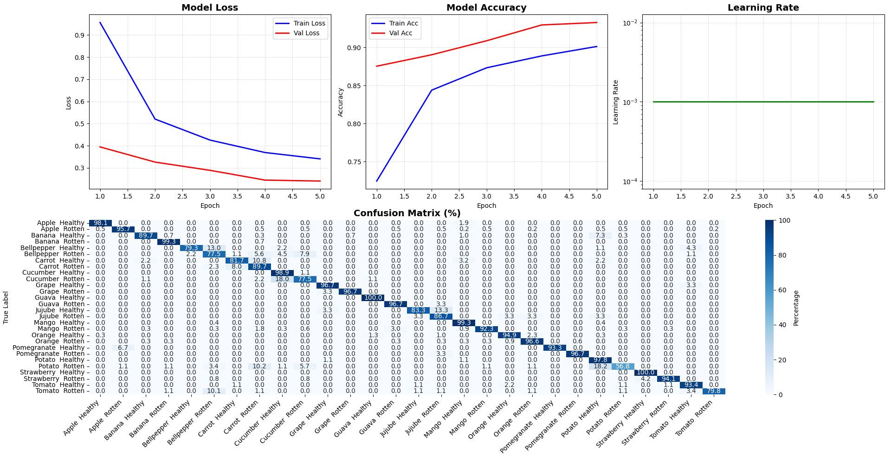
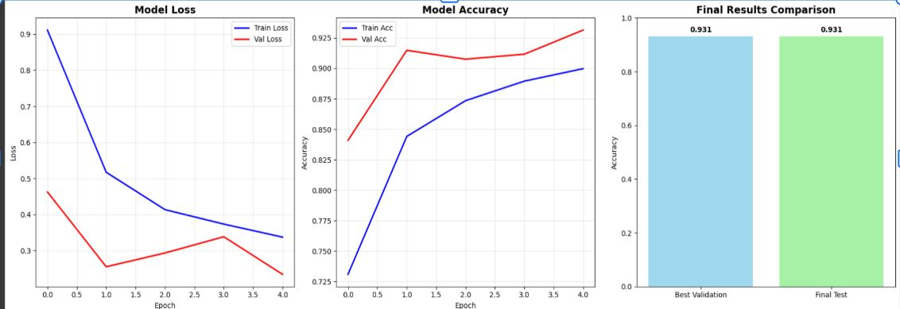

EfficientNet for Fruit Disease Detection
A machine learning project implementing EfficientNet architecture for automated detection and classification of fruit diseases. This project was developed as part of CS-539 coursework.

Project Overview
This project leverages the power of EfficientNet, a state-of-the-art convolutional neural network architecture, to classify various fruit diseases with high accuracy. The model can distinguish between healthy and diseased fruits across multiple fruit categories including apples, bananas, bell peppers, carrots, cucumbers, grapes, guavas, jujubes, mangoes, oranges, pomegranates, potatoes, strawberries, and tomatoes.

Key Results
Final Test Accuracy: 93.1%
Validation Accuracy: 93.1%
Model Architecture: EfficientNet
Classes Supported: 28+ fruit disease categories (healthy + diseased variants)

Model Performance
Training Metrics
Loss Convergence: Decrease from ~0.9 to ~0.35
Training Accuracy: Progressive improvement to ~90%
Validation Accuracy: Consistent performance at ~93%
Learning Rate: Optimized scheduling for stable convergence

Dataset
The model was trained on a comprehensive fruit disease dataset containing:
Fruit Categories: Apple, Banana, Bell Pepper, Carrot, Cucumber, Grape, Guava, Jujube, Mango, Orange, Pomegranate, Potato, Strawberry, Tomato
Health Status: Healthy and various disease conditions for each fruit type
Image Quality: High-resolution images suitable for computer vision tasks

Model Architecture
EfficientNet was chosen for this project due to its:
Superior accuracy-to-parameter ratio
Efficient scaling across different model sizes
State-of-the-art performance on image classification tasks
Transfer learning capabilities

